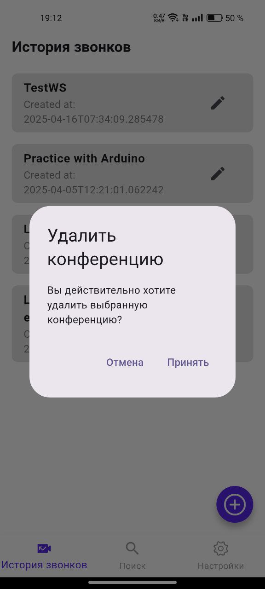
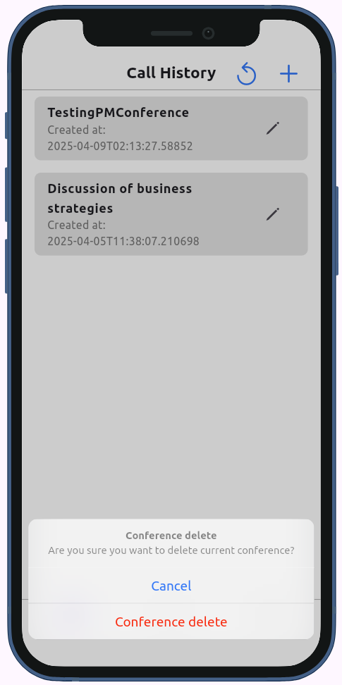

  C O M F O R T C O N F Y

  Мобильное приложение для видеоконференций 

  

>[!IMPORTANT]
> Использование исходного кода приложения разрешено согласно правилам, указанные в лицензии на распространие исходного кода MIT Licence. 

>[!IMPORTANT]
>[Backend-сервис мобильного приложения](https://github.com/EgorSborschikov/conferences_backend/)
  

## Функциональные возможности пользователей:

- [X] **Регистрация, авторизация и аутентификация**: Пользователи могут создавать аккаунты в приложении и осущесталять из-под них деятельность в приложении;
- [X] **Управление видеоконференциями**: Создание и получения ссылки для подключения, редактирование названияб удаление конференции; Организация видеоконференции по заданным параметрам;
- [X] **История звонков**: Получение списка прошедших конференций у пользователя, который их создал;
- [X] **Поиск видеоконференций**: Пользователи могут подключится к видеоконференции из мобильного приложения, введя название конференции или ссылку для подключения;
- [X] **Участие в видеоконференциях**: Присоединение и покидание видеоконференций, обмен данными внутри команты конференции;
- [ ] **Динамика передачи информации**: Индикация голоса передаваемый через микрофон данных;
- [ ] **Техническая поддержка**: Подсистема для ответов на вопросы пользователей в виде телеграм-бота или по Email.

## Технологический стек:

### Мобильное приложение:

### Аутентификация:

## Преимущества приложения:

- **Нативность**: Для мобильных платформ Android & iOS виджеты выполнены в нативном стиле, что обеспечивает улучшение пользовательского опыта;

- **Темная тема**: Пользователи могут изменить цветовую схему на сове усмотрение;

- **Локализация**: Пользователи могут выбрать язык интерфейса на свое усмотрение (на данный момент доступен русский и английский языки);

- **Открытость**: Пользователи могут посмотреть исходный код программного продукта и убедится в безопасности, предложить изменения, позаимствовать элементы кода для своих проекта (согласно правилам MIT License).

## Экраны

### Демонстрационные модели:
- **Android**: Realme 11

- **iPhone**: iPhone 12 mini

<h3>История звонков</h3>
<table align="center">
  <tr>
    <td style="padding: 10px;"></td>
    <td style="padding: 10px;"></td>
  </tr>
  <tr align="center">
    <th>Android</th>
    <th>iOS</th>
  </tr>
</table>

<h3>Создание конференции</h3>
<table align="center">
  <tr>
    <td style="padding: 10px;"></td>
    <td style="padding: 10px;"></td>
  </tr>
  <tr align="center">
    <th>Android</th>
    <th>iOS</th>
  </tr>
</table>

<h3>Опции для конференции</h3>
<table align="center">
  <tr>
    <td style="padding: 10px;"></td>
    <td style="padding: 10px;"></td>
  </tr>
  <tr align="center">
    <th>Android</th>
    <th>iOS</th>
  </tr>
</table>

<h3>Изменение названия конференции</h3>
<table align="center">
  <tr>
    <td style="padding: 10px;"></td>
    <td style="padding: 10px;"></td>
  </tr>
  <tr align="center">
    <th>Android</th>
    <th>iOS</th>
  </tr>
</table>

<h3>Каскадное удаление конференции</h3>
<table align="center">
  <tr>
    <td style="padding: 10px;"></td>
    <td style="padding: 10px;"></td>
  </tr>
  <tr align="center">
    <th>Android</th>
    <th>iOS</th>
  </tr>
</table>

<h3>Поиск конференций</h3>
<table align="center">
  <tr>
    <td style="padding: 10px;"></td>
    <td style="padding: 10px;"></td>
  </tr>
  <tr align="center">
    <th>Android</th>
    <th>iOS</th>
  </tr>
</table>

<h3>Фильтрация поиска по названию</h3>
<table align="center">
  <tr>
    <td style="padding: 10px;"></td>
    <td style="padding: 10px;"></td>
  </tr>
  <tr align="center">
    <th>Android</th>
    <th>iOS</th>
  </tr>
</table>

<h3>Комната конференции</h3>
<table align="center">
  <tr>
    <td style="padding: 10px;"></td>
    <td style="padding: 10px;"></td>
  </tr>
  <tr align="center">
    <th>Android</th>
    <th>iOS</th>
  </tr>
</table>

<h3>Настройки</h3>
<table align="center">
  <tr>
    <td style="padding: 10px;"></td>
    <td style="padding: 10px;"></td>
  </tr>
  <tr align="center">
    <th>Android</th>
    <th>iOS</th>
  </tr>
</table>

<h3>Темная тема</h3>
<table align="center">
  <tr>
    <td style="padding: 10px;"></td>
    <td style="padding: 10px;"></td>
  </tr>
  <tr align="center">
    <th>Android</th>
    <th>iOS</th>
  </tr>
</table>

<h3>Смена языка интерфейса</h3>
<table align="center">
  <tr>
    <td style="padding: 10px;"></td>
    <td style="padding: 10px;"></td>
  </tr>
  <tr align="center">
    <th>Android</th>
    <th>iOS</th>
  </tr>
</table>

